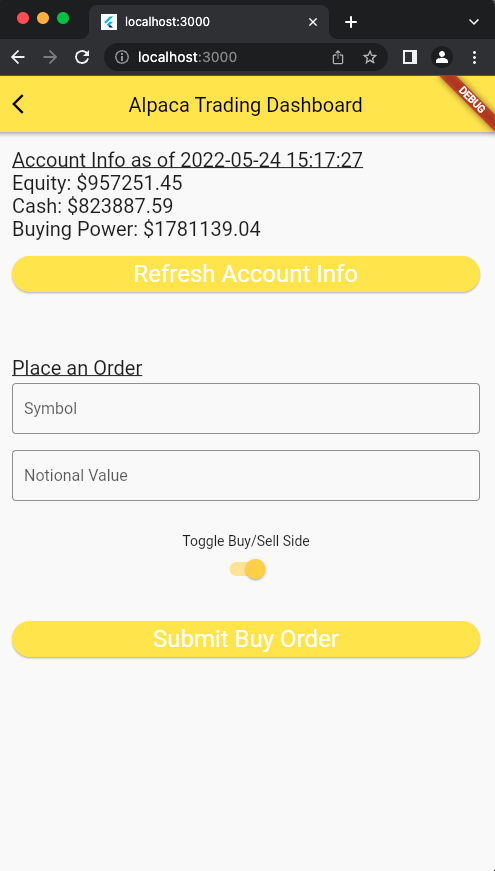
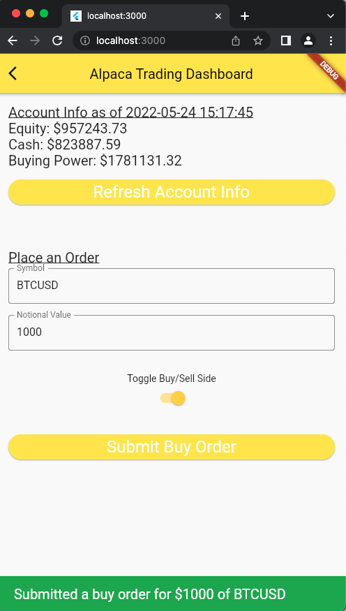

# Alpaca OAuth Crypto Trading App with Flutter

A boilerplate flutter project that enables users to trade stocks and crypto using [Alpaca's API](https://alpaca.markets/docs/api-references/).

Features the ability to make trades at market price, refresh current account
information, and authentication through OAuth2.

